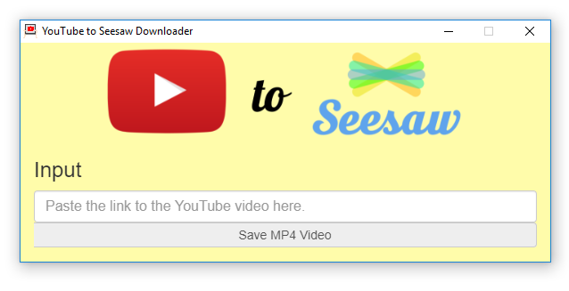

# YouTube Downloader for Seesaw

This is a simple program for downloading YouTube videos optimized for Seesaw.
Simply paste in the link to the YouTube video you want to download, and press
the save button. Automatically the program will grab the highest-quality version
of the video available and save it to your chosen output directory in MP4
format, the file format expected by Seesaw.

This is an open-source project unaffiliated with Seesaw built as a convenience
for educators.

# How to Install
Using the download links at the top of this page, select the version that matches
your system. The application is currently available for Windows and MacOS.
